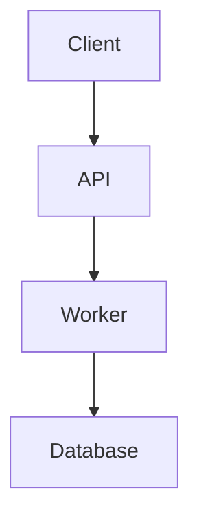
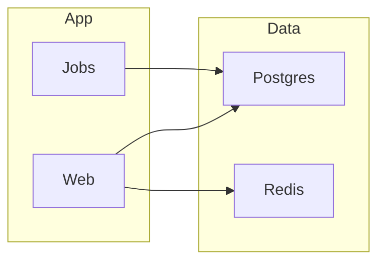
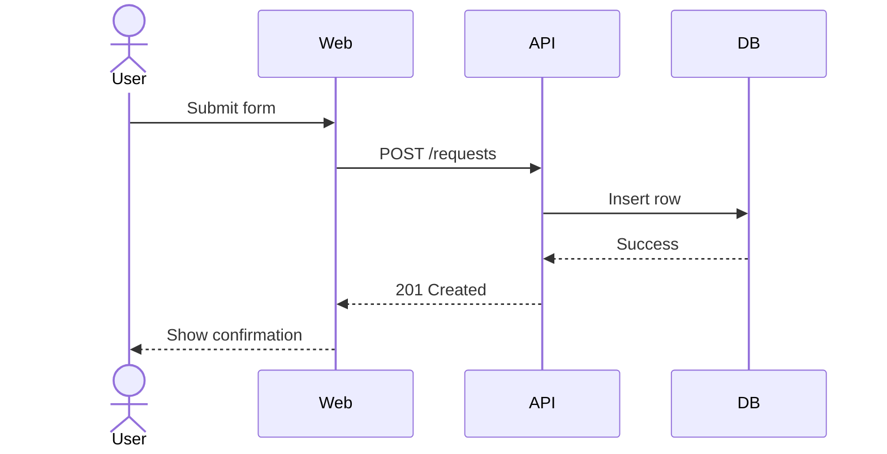
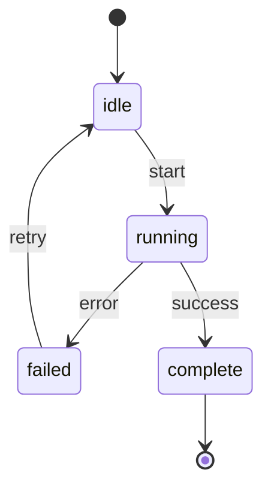
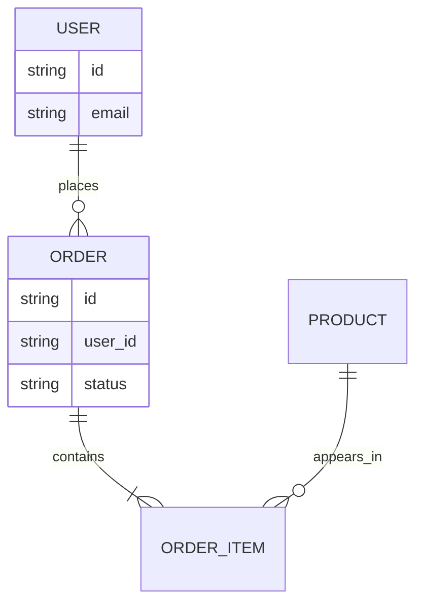
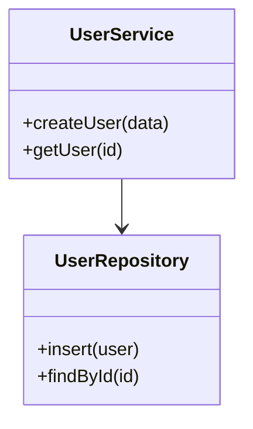

# Mermaid Patterns

Use these templates as starting points. Choose the smallest pattern that answers the user's question.

## Flowchart

Best for process flow, architecture, dependency flow, and decision trees.



Guidance:

- Use `TD` for top-to-bottom and `LR` for left-to-right.
- Use `subgraph` for logical groups.
- Keep branch labels short.



## Sequence Diagram

Best for request lifecycles, handoffs, integrations, and debugging event order.



Guidance:

- Use `actor` for humans or external actors.
- Use `-->>` for responses and `->>` for requests.
- Use `Note over` sparingly for key clarifications.

## State Diagram

Best for lifecycle rules, async job states, UI states, and approval flows.



Guidance:

- Use explicit event labels on transitions.
- Keep states noun-like and transitions verb-like.
- Prefer this over flowcharts when the real question is "what states can this thing be in?"

## ER Diagram

Best for databases and domain entities with relationships.



Guidance:

- Use for data relationships, not runtime call flow.
- Include only the fields needed to explain the relationship.

## Class Diagram

Best for type relationships, interfaces, and composition.



Guidance:

- Use only when the user is asking about code structure or API shape.
- Do not use class diagrams to explain a process. Use a flowchart or sequence diagram instead.

## Timeline

Best for history, rollout steps, milestones, and incident narratives.

```mermaid
timeline
    title Release Timeline
    09:00 : Deploy started
    09:05 : Migration completed
    09:12 : Health checks passed
    09:20 : Traffic shifted
```

## Diagram Review Checklist

Before sending the diagram, check:

1. Does the diagram answer one clear question?
2. Is there a better Mermaid type for this question?
3. Can any labels be shortened without losing meaning?
4. Should this be split into two diagrams?
5. Are inferred parts clearly described in prose?
6. If rendering in the browser failed, did you provide raw Mermaid plus the editor link?
